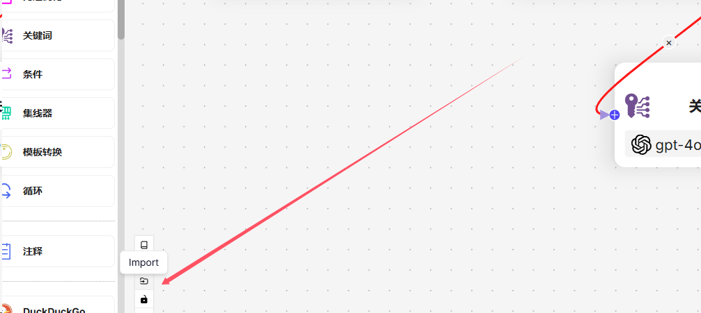

# 智学通
智学通 是一个基于 Python 和 Vue.js 的在线教育平台，旨在为教师和学生提供便捷、高效的教学工具。平台集成了多种功能，包括教案生成、班会稿生成、主观题判题、个性化学习推荐等，以帮助提高教师的教学效率和学生的学习效果。

<p align="center">
    
    
</p>


---

## 一、项目概述
**智学通** 是一个全功能的在线教育平台，专为教育工作者与学习者设计。其主要目标是通过智能化的工具带来方便的教学体验。平台的关键功能包括：

- 教案生成：教师可以快速生成标准化教学计划，节省备课时间。
- 班会稿生成：教师可根据某一主题自动生成班会方案，为管理班级活动提供支持。
- 主观题判题：一键自动评分与反馈，帮助教师高效管理学生的主观题答卷。
- 个性化学习推荐：依据学生的学习习惯与成绩提供个性化的学习资源和建议。
- 知识跟踪：能智能分析学生知识点掌握情况，实时明晰学生学习效果。

通过这些功能，智学通 旨在为教师和学生提供全面、灵活的在线学习和教学支持。


---

## 二、安装说明
在安装 **智学通** 之前，请确保系统中有如下环境配置，请尽量保持一致。 **智学通** 支持Windows、Linux操作系统。
- **Python** 3.11.9
- **RAGflow** v0.17.0-57-g4f950430 ful
- **MySQL** v8.0.30
- **Vue.js** v5.0.8
- **Node.js** v22.15.0
- **npm** v10.9.2

注：RAGflow 是一款基于深度文档理解构建的开源 RAG 引擎，本系统基于其构建外部知识库。具体安装请参考官网：https://github.com/infiniflow/ragflow


### 安装步骤：

1. **克隆项目仓库：**

   ```bash
   git clone https://github.com/QuniteZone/EduPlatform2.git
   ```
2. **安装并配置RAGflow：**
   
    按照[RAGflow官方文档](https://github.com/infiniflow/ragflow/blob/main/README_zh.md)，安装好RAGflow。并且需要分别构建好两个知识库（教材知识库、离线资源知识库），简单测试达到基本能使用程度。

    用于构建两个知识库的文件在“EduPlatform2/Backend/RAGflow/RAGflow资源库”目录下面。教材知识库构建知识库时各参数保持默认即可。离线资源知识库时仅需修改知识库“**分段标识符**”，其内容具体如下。另外RAGflow所用embedding-LLM：ZHIPU-AI embedding-3，对话LLM使用gpt-4o-mini。
   ```bash
   \n!?;。；！？}
   ```
   在RAGflow中，导入EduPlatform2/Backend/RAGflow中两个agent-json文件，并进入RAGflow Web页面中为agent设置好对应检索知识库。教材知识点agent.json对应Agent的知识库对应是教材知识库、离线资源推荐agent.json对应Agent的知识库对应是离线资源知识库。

   <div style="text-align: center;">
       
        <br>
        (RAGflow中导入agent-json文件，位于agent页面左下角)
   </div>

   最后在RAGflow web页面中，将RAGflow服务器IP地址、服务器api-key、两个agent对应的Agent ID记录下来，后将用于设置环境参数配置，参照如下格式。

   ```python
   ragflow_BASE_URL = "https://9vh4i*****19.vicp.fun"            # rag_flow的后端地址
   ragflow_API_KEY = "ragflow-k5MTJmNmQ0MDdiMj**********MDI0Mm"  # rag_flow的密钥
   TextbookRetr_AgentID = f"4962e4b824051*********42ac120006"    #Agent ID
   QuesGen_AgentID="cca846541d1d11f*************f6ef"            #Agent ID
   ```


3. **环境参数配置：**

   进入EduPlatform2\Backend\config\config.py文件中。配置好**链接MySQL数据库的参数**、**base-LLM 和多模态LLM的api-key相关参数**、**搭建的RAGflow服务IP及相关密钥等**，参照如下格式。
   ```python
   # 数据库配置
   DIALECT = 'mysql'
   DRIVER = 'pymysql'
   USERNAME = ''              # 数据库用户名
   PASSWORD = ''              # 数据库密码
   HOST = ''                  # 数据库地址
   PORT = ''                  # 数据库端口
   DATABASE = ''              # 数据库名称
   SQLALCHEMY_DATABASE_URI = f"{DIALECT}+{DRIVER}://{USERNAME}:{PASSWORD}@{HOST}:{PORT}/{DATABASE}?charset=utf8"
   ```
   ```python
   # base-LLM 和多模态LLM的api-key相关参数
   #LLM 基本配置信息
   os.environ["OPENAI_BASE_URL"] = "https://api.chata******rg/v1"
   os.environ["OPENAI_API_KEY"] = "sk-FUFiwSHFPr9S3ofp9kGjV********UaJO5i"
   model = "gpt-4o-mini" #LLM模型名称，如gpt-4o-mini。大模型上下文至少需支持16k上下文长度
   temperature=0.5 #LLM 温度
   
   #多模态LLM的基本配置信息
   os.environ["DASHSCOPE_API_KEY"] = "sk-b8ee8eb*********be405c9"
   LLMs_model="qvq-max" #多模态LLM模型名称，如qvq-max
   ```
   ```python
   #rag_flow的相关参数
   ragflow_BASE_URL = "https://9vh4i*****19.vicp.fun"            # rag_flow的后端地址
   ragflow_API_KEY = "ragflow-k5MTJmNmQ0MDdiMj**********MDI0Mm"  # rag_flow的密钥
   TextbookRetr_AgentID = f"4962e4b824051*********42ac120006"    # Agent ID
   QuesGen_AgentID="cca846541d1d11f*************f6ef"            # Agent ID
   Public_ip="https://******cp.fun"                              #后端的公网IP地址或域名，非必须
   ```
   注：其中Public_ip="https://******cp.fun"参数配置非必须，该为将后端部署于云服务器上的公网IP地址或域名。若该参数不配置，则功能中作业辅导——上传文件功能无法正常使用。
   
   另外，还需要进入EduPlatform2/Frontend/.env文件中，配置好前端所需参数，分别包括base-LLM和AI-PPT密钥。申请AI-PPT密钥请参考官网：https://www.aippt.cn/
   ```bash
   VUE_APP_API_BASE_URL=https***********ch
   VUE_APP_API_KEY=sk-FUFiwSHF******************aJO5i
   PPT_API_KEY=ak*****************58Rf
   ```

4. **设置后端：**

   进入后端目录并安装依赖：

   ```bash
   cd EduPlatform2/Backend
   ```
   ```bash
   pip install -r requirements.txt
   ```
   由于本系统将服务注册到nacos服务器，需要额外安装nacos-service包。需要执行以下命令。
   ```bash
   cd EduPlatform2/Backend/config
   pip install nacos_service-0.1-py3-none-any.whl
   ```
   安装好依赖后，即可成功启动后端。需要先回退到EduPlatform2/Backend目录中。若是windows系统下，使用如下命令行启动服务：
   ```bash
   waitress-serve --port=5001 app:app
   ```
   若是linux系统下，使用如下命令行启动服务：
   ```bash
   gunicorn -w 4 -b 0.0.0.0:5001 app:app
   ```


5. **设置前端并启动：**

   进入前端目录并安装依赖：

   ```bash
   cd EduPlatform2/Frontend
   ```
   
   ```bash
   npm install
   ```
   
   ```bash
   npm run serve
   ```
   启动前端后，即可在浏览器中访问[http://localhost:8080/](http://localhost:8080/)，即可使用EduPlatform。

## 三、使用方法
   如何使用 EduPlatform：目前无需注册，成功运行后，直接访问对应Web页面即可使用。
   

**功能模块**

- **智能教案生成**：教师选择年级、科目和章节，系统自动生成标准化教学设计文档，支持一键导出为Word文档。
- **课堂逐字稿生成**：教师上传讲课提纲后，系统生成详细逐字稿，格式为可编辑的Word文档。
- **课件PPT生成**：输入相关信息后，系统自动生成与教案匹配的PPT课件，支持直接下载为PPT格式。
- **智能班会策划**：教师设定班会主题和目标，系统生成班会方案并支持Word导出。
- **自动出题**：教师设定题目参数，系统生成新题目，并提供参考答案和解析。
- **知识点梳理**：上传教材或笔记后，系统提取核心概念并构建可视化思维导图。
- **主观题智能辅助批改**：教师上传参考答案，系统提供评分和批改建议，支持一键确认。
- **作业智能辅导**：学生上传题目，系统识别并提供逐步解析，帮助学生理解解题方法。
- **个性化学习计划生成**：根据学生状况和目标自动制定学习计划，适用于考前冲刺与课后巩固。

**后续开发更多功能**
- **薄弱知识点分析**：系统分析学生错题，识别高频错误知识点并评估掌握情况。
- **学生画像构建**：持续采集学生学习数据，构建多维学生画像，用于个性化推荐与评估。
- **学习进度监控**：实时监控学生学习进度，提供个性化学习建议与调整。
- **报告生成**：按机构、教师、班级和学生生成统计分析报告，支持下载和分享。
......

---

## 四、项目结构
下面是项目的基本结构：

```
EduPlatform2/
├── Backend/                       # 后端目录
│   ├── Apps/                      # 应用逻辑相关
│   │   ├── DatabaseTables.py      # 数据库表相关定义  
│   │   ├── genericFunction.py     # 通用函数
│   │   ├── lesson_plan.py         # 课程教案等功能路由
│   │   ├── question_handle.py     # 课程问题等功能路由
│   │   └── ragflow_operations.py  # RAGflow所封装的操作
│   ├── config/                    # 配置文件夹
│   │   ├── config.py              # 主要配置文件
│   │   ├── service.config         # 服务配置
│   │   └── nacos_service-0.1-py3-none-any.whl      # Nacos服务依赖
│   ├── RAGflow/                  # RAGflow资源相关
│   │   ├── RAGflow资源库          # 存放用于构造RAGflow资源库的文件
│   │   ├── 资源推荐agent.json     # 资源推荐代理配置
│   │   └── 逐字稿Agent.json       # 其他代理配置
│   ├────── app.py                # flask后端启动文件
│   └────── requirements.txt      # 后端依赖文件
├── Frontend/                     # 前端目录
│   ├── public/                   # 公共资源
│   ├── src/                      # 前端源代码
│   ├── .env                      # 环境变量
│   ├── babel.config.js           # Babel配置
│   ├── jsconfig.json             # JavaScript配置
│   ├── package.json              # 项目元数据和依赖
│   ├── package-lock.json         # 锁定的依赖版本
│   ├── tsconfig.json             # TypeScript配置
│   └── vue.config.js             # Vue CLI配置，包括后端IP地址、前端启动端口等
├── TestCode/                     # 测试代码目录
└────── README.md                 # 测试说明文件

```

---

## 五、技术选型
- **后端框架**：使用 Python Flask 框架，提供灵活的后端解决方案。
  
- **数据库**：MySQL 数据库，支持数据的稳定存储与检索。
  
- **前端**：Vue.js 框架，具备良好的组件化能力与响应式特性。
  
- **UI 组件库**：Element Plus，提供高质量的 UI 组件支持，增强用户体验。

- **Markdown 解析**：使用 `marked.js` 进行 Markdown 解析，方便内容的编辑与展示。
  
- **富文本编辑器**：：WangEditor，为用户提供简单易用的文本编辑解决方案。
---

## 六、配置说明
EduPlatform 的主要配置文件包括：

- **app.py**：后端主应用配置，包括应用路由与应用程序初始化。
- **config.py**：后端全局配置文件，包括数据库连接配置及其他应用参数。
- **package.json**：前端依赖包配置文件，管理前端使用的 npm 包及脚本。
- **jsconfig.json**：前端 JavaScript 配置文件，提供类型识别与 IntelliSense 支持。
- **babel.config.js**：前端 Babel 的配置文件，适配 ES6+ 环境。
- **tsconfig.json**：前端 TypeScript 配置文件，提供类型检查与编译设置。
